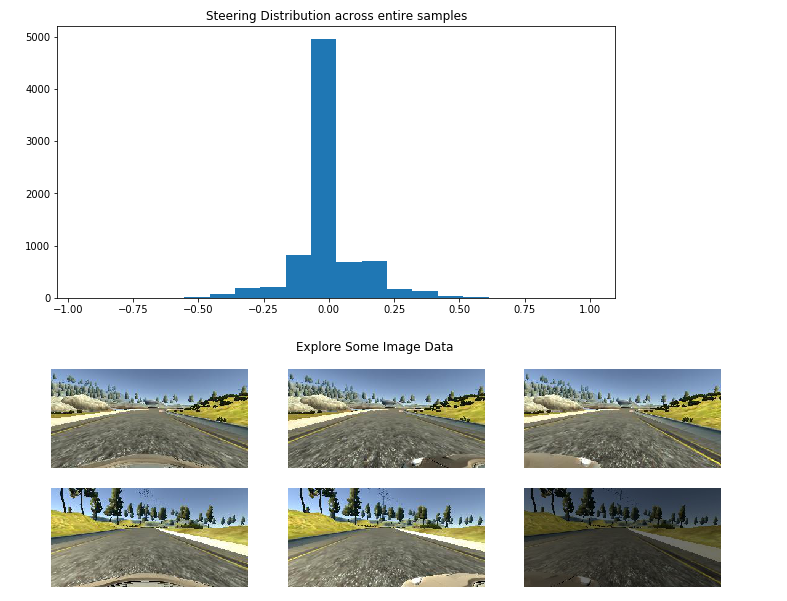
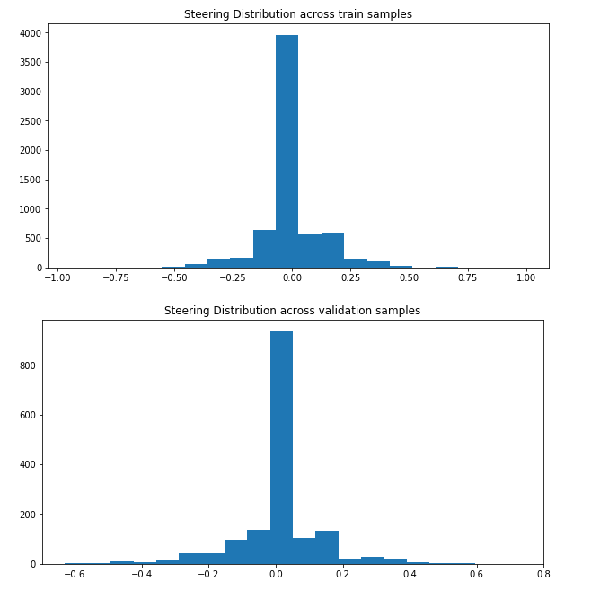
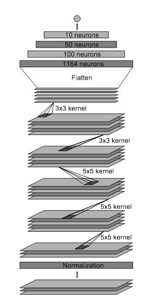
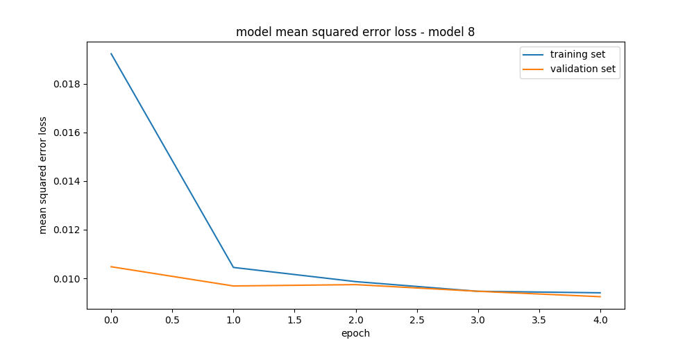

# Driving Behaviorial Cloning

### Purpose:
The goals / steps of this project are the following:
* Use the simulator to collect data of good driving behavior
* Explore the collected data
* Data preparation and augmentation to generate more data from the collected dataset
* Build, a convolution neural network in Keras that predicts steering angles from images
* Train and validate the model with a training and validation set
* Test that the model successfully drives around track one without leaving the road
* Summarize the results with a written report

### Data Preparation and Exploration
Code snippet:
```# Data extraction
filename = './data/data/driving_log.csv'
samples = data_extraction(filename)
    
#Data exploration for entire dataset
data_exploration(samples, text='entire samples')
plot_images()
```

As you can see from the histogram plot showing the steering distribution across the entire dataset below, the steering angles tend to bias towards the left turns.

To generate more dataset, among the technique which I use to generate augmented data is to randomly adjust the brightness of the images as shown in the 6th image (darker) below.

<figure>
    
</figure>

80/20 split to create train and validation data respectively.  In the train data, I used lots of augmented techniques to generate more data: horizontal flipping, randomly brightness.  However, I didn't apply any augmented technique for the validation data.  The validation data only used once when the training is converged.

Data exploration for the train and validation samples

<figure>
    
</figure>

As you can see from the two histogram plots above, the training samples tend to bias towards the left turns whereas the validation samples tend to bias towards the right turns

To help with the left turn bias as you can see from the dataset, I have used several techniques as described in more details below:

- Flip the data images horizontally and take the opposite sign of the steering angles:  This technique helps to balance out the right and left turn in the race track which may help to reduce the left turn bias as you can observe in the dataset.  You can see the codes of this flipping technique in the function **data_flip()** in the **model8.py** 

- Instead of using only center camera image data for training and validation, I used all three cameras: left, center, right.  For the left camera, I added a small 0.12 angle coefficient to compensate for the left turn bias effects.  For the right camera, I did the opposite way by subtracting the 0.12 angle coefficient to take care of the scenarios if the car may go to far to the right.  You can see the codes of using three cameras in the function **generator()** in the **model8.py**

- I also added the randomly brightness effects to the data images to augment more data and make the image data more robust to any lighting condition which may effect during data training. You can see the codes of using randomly brightness effects in the function **augment_brightness** in the **model8.py**

In addition to the bias data which I discussed above, I also normalized the data to zero mean and cropped the image data by using the Kera function **Cropping2D**.  I was using 45 pixel top, and 20 pixel bottom cropping technique and this seems to help to reduce noises in the data training.  You can see the codes of normalizing and cropping the image data in the function **my_model()** in the **model8.py**

### Model Architecture and Training Strategy
I used the NVDIA architecture as described in http://images.nvidia.com/content/tegra/automotive/images/2016/solutions/pdf/end-to-end-dl-using-px.pdf

This model consists of:
- three 5x5 convolution layers with the maximum pool size of (2,2) and strides of (1,1)
- two 3x3 convolution layers with the maximum pool size of (2,2) and strides of (1,1)
- activation layers 'RELU' introduce between convolution and fully connected layers to add non-linearity to the model
- one flatten layer
- 5 Dense/Fully connected layers

The details of this model implementation can be found in the **model8.py** in the function **my_model()**.

**Here is the visualization of the model:**
<figure>
    
</figure>

There are several Optimization techniques, however, in this project I used the Adam Optimization and epoch=5 to train this model. In general, this Adam Optimization uses momentum and tends to give me better and faster converge. I also used the MSE (Mean Square Error) for my training.  This MSE is very typical technique in ML to look at errors during data training.

Since in the project, I was using lots of augmented data to generate more data as discussed earlier, It seemed that I wasn't facing a lots of overfitting issues - by looking at the training and validation loss (see below).  Therefore, I didn't use any dropout techniques in this project. Initially, I played around by adding the dropout functions in my model.  Adding dropout function seemed to cause my model taking a longer time to converge.  I had to increase the number of epochs=10+ for my model to converge and the final plot of traing and validation loss seemed very much the same as if I didn't use the dropout functions.  

Because the dataset (+ augmented data) with the image size (160x320) was large and could not fix entirely in the memory during data training, one technique which I've used to speed up the training process and only loaded the data on the fly when needed was using the generator.  You can see the codes of using three cameras in the function **generator()** in the **model8.py**

<figure>
    
</figure>

### Quality of Codes - Final thoughts:
The model8.py describes the techniques to collect, to augment for more data and to train the convolution neural networks.  It is used the python generator to generate data on the fly rather than stores the entire dataset in the memory.  By doing this, it doesn't exhaust the memory resources and improve the performance.  

You can execute the autonomous driving by: python drive.py model8.py
